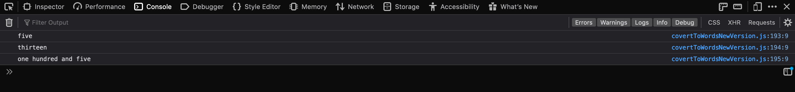

#ConvertToWords

The convertToWords(number) function receives one parameter when a number is passed as an argument, the function returns a string with the number written its ***alphabetical form***. 

**Example:**
input: 1
output: "one"

---
##Code 
The code is mostly two arrays one (singleDigitsNumbersArray)that has the numbers from 0-9 and the other one(singleDigitsNumbersNames) has the numbers from 0 to 9 written in its alphabetical form. 

Then there is a varible named(TwoDigitsNumbersEnding ) that holds a string with the ending of most of two digits numbers.

The algorithm takes a base number from the second array(singleDigitsNumbersNames) and combine it with the string that is stored in the (TwoDigitsNumbersEnding ) variable to form a two digits number. 

```JavaScript 
/* To work with three digits numbers, we have a function that retrieves the last digit from the number that has been passed to the function and then it is  treated the same way as an one digit number. 

This function is called inside the main function (convertToWords())
*/

function retrieveTheLastNumberOfAThreeDigitsNumber(number) {
    let numberToString = number.toString();
    let lastDigitOfAThreeDigitNumber = numberToString.slice(2, 3);

    return parseInt(lastDigitOfAThreeDigitNumber);
}

```
---

###Function Output



console.log(convertToWords(5));
console.log(convertToWords(13));
console.log(convertToWords(105));
